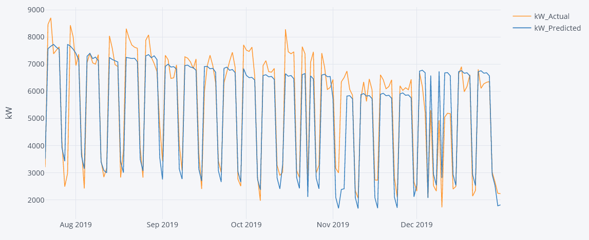
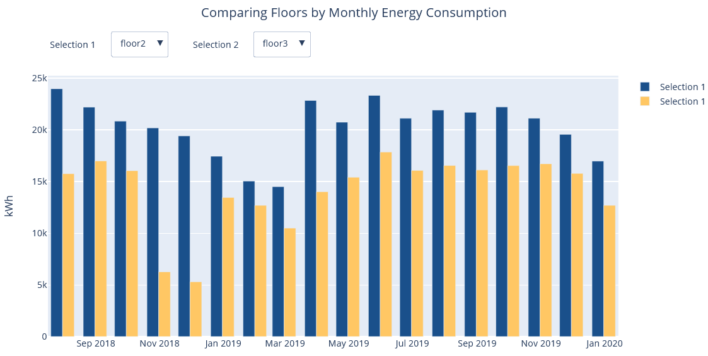
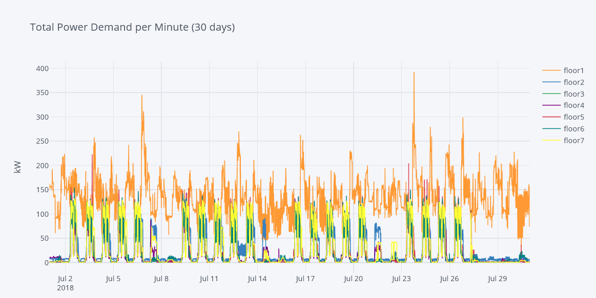
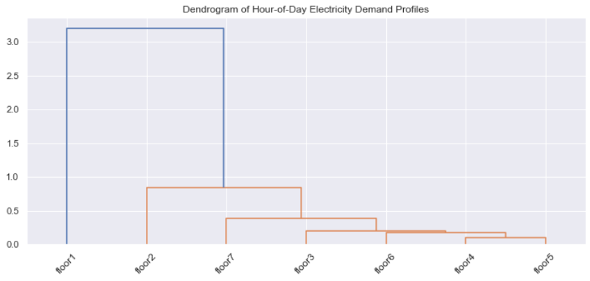
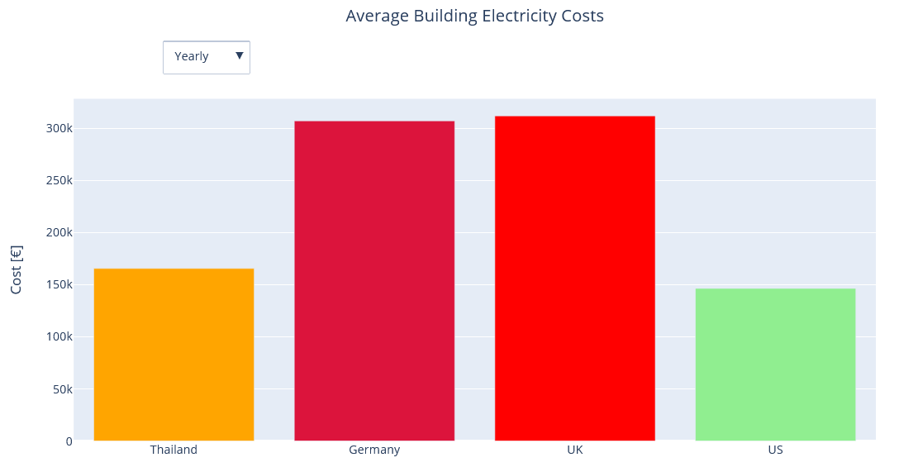

# Building Power Demand Prediction

## Introduction

Office buildings have an important role in shaping electricity demand in modern societies. Their energy demand patterns account in some countries for up to 45 % of the primary energy consumption. Furthermore, office buildings are likely to have higher cooling demands in the future due to climate change, thus increasing power demand. Monitoring energy consumption of buildings and appliances using smart meters allows for a better understanding of energy needs and patterns, as well as locating peak demand times which can help decision-makers and planners to improve electricity consumption. 

  

## Goal

In this project, I will be looking at power demand time series data collected from different appliances in a seven-story academic office building located at Chulalongkorn University. Using a SARIMA model, I will attempt to predict the daily power demand of the entire building.

## Overview 

* Cleaned and restructured the raw data into a multi-index data frame.
* Conducted an extensive EDA to locate trends in the power demand.
* Used hierarchical agglomerative clustering to cluster building floors based on similarities.
* Calculated the average annual electricity cost of the building in Thailand and compared it to the cost in other countries.
* Trained a SARIMA model to predict daily power demand using the time series data taking into account weekends and national holidays.
* SARIMA model had an RMSPE of 12% and an R² of 0.82

 

## Code and Resources Used 
- **Python Version:** 3.8  
- **Packages:** pandas, numpy, sklearn, matplotlib, seaborn, scipy, plotly, statsmodels
- **Building Data:** https://www.kaggle.com/claytonmiller/cubems-smart-building-energy-and-iaq-data
- **Holiday Data:** Google.com
- **Code Refrences:** https://www.kaggle.com/sumi25/understand-arima-and-tune-p-d-q

## EDA & Clustering
To understand the data obtained from the cleaned dataset, an analysis was conducted to develop insight and locate trends in power demand. 

 
 

  
 
 

## Model Building
The initial SARIMA model that was used to predict power demand based only on time series data performed poorly and was improved by taking into consideration external regressors such as weekends and national holidays. 
The following evaluation metrics were used to evaluate the performance of the model:
* Root Mean Squared Percent Error (RMSPE)
* R-squared (R²)

## Results 
The model’s performance is shown in the following table: 
   
| Evaluation Metric  |   SARIMA   |SARIMA with external regressors |
|-------------------:|:----------:|:------------------------------:|
| **RMSPE**          |   26%      |              12%               |
| **R²**             |  0.52      |              0.82              |

